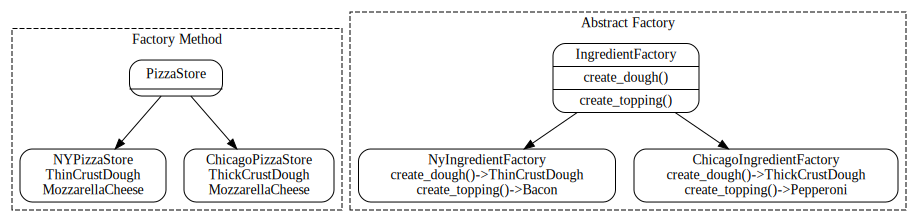

# 🍕 Pizza Factory - Modern Design Patterns Implementation in C++17


[](https://github.com/errowdrigorena/pizza_factory/actions)
[](LICENSE)
[](https://isocpp.org/std/the-standard)
[](https://cmake.org/)

## 📋 Overview

This project provides highly reusable and generic utilities for building and extending the **Factory Method** and **Abstract Factory** design patterns in C++17. Rather than focusing on a single implementation, it offers flexible building blocks (`concrete_creator` and `dynamic_factory`) that make it trivial to create, compose, and reuse factories in any domain.

The pizza example is used as a nod to "Head First Design Patterns"—the first design patterns book I read, and likely the first for many developers. It is chosen simply to avoid unnecessary friction and to provide a familiar context. Ultimately, only two files (`concrete_creator` and `dynamic_factory`) are the real focus of this project; everything else exists to demonstrate how they work and to prove their correctness in practice.

The code follows industry best practices and is designed to be:

- ✅ **Reusable**: The core of this project is not just the implementation of design patterns, but the provision of generic utilities (`concrete_creator` and `dynamic_factory` in `include/factory/`) that make it extremely easy to build and extend Factory Method and Abstract Factory patterns. These utilities are not patterns themselves, but highly reusable building blocks that enable type-safe, decoupled, and extensible object creation for any domain, not just the pizza example.
- ✅ **Maintainable**: Clean, well-documented code following modern style guides
- ✅ **Flexible**: The provided files are not direct pattern implementations, but reusable elements that make the construction of concrete and dynamic factories trivial. Their design allows them to be used for classic patterns or any scenario requiring flexible, decoupled object instantiation, making them valuable beyond the scope of design patterns alone.
- ✅ **Testable**: Complete test coverage with GoogleTest
- ✅ **Modern**: Utilizes C++17 features like smart pointers and move semantics

## 🏗️ Architecture

The project implements a composition-based architecture following the Open/Closed principle:



The image above is generated automatically from `docs/architecture.gv` as `docs/architecture.svg` during the CI workflow.

```
📦 PizzaFactory
├── 🏭 Factory Method
│   ├── PizzaStore (interface)
│   │   ├── order(type: string) -> unique_ptr<Pizza>
│   ├── NYPizzaStore
│   │   ├── Thin crust dough
│   │   └── Mozzarella cheese
│   └── ChicagoPizzaStore
│       ├── Thick crust dough
│       └── Mozzarella cheese
└── 🏭 Abstract Factory
    ├── IngredientFactory (interface)
    └── ChicagoIngredientFactory
        ├── create_dough() -> ThickCrustDough
        └── create_topping() -> Pepperoni
```

## 📖 Implementation Details

### Factory Method Pattern

The Factory Method pattern is implemented through two concrete pizza stores:

#### NYPizzaStore
- Uses thin crust dough for a crispy texture
- Implements NY-style pizza creation with specific ingredients
- Available pizzas: cheese, pepperoni, pineapple, bacon, and veggie

#### ChicagoPizzaStore
- Uses thick crust dough for a deep-dish style
- Implements Chicago-style pizza creation with specific ingredients
- Available pizzas: cheese, pepperoni, pineapple, bacon, and veggie
- Each pizza is created with Chicago-style ingredients (thick crust, mozzarella cheese, etc.)

### Abstract Factory Pattern

The Abstract Factory pattern is implemented through the ingredient factory system:

#### ChicagoIngredientFactory
- Creates a family of Chicago-style ingredients
- Produces thick crust dough and spicy pepperoni
- Each ingredient is created with specific Chicago-style characteristics

### Current Classes
- **Dough**: `ThinCrustDough`, `ThickCrustDough`
- **Toppings**: `MozzarellaCheese`, `Pepperoni`, `Pineapple`, `Bacon`, `Tomato`
- **Pizzas**: created by `NyPizzaStore` and `ChicagoPizzaStore`

## 🚀 Getting Started

### Prerequisites

- C++17 compiler (GCC 7+, Clang 5+, MSVC 2017+)
- CMake 3.16 or higher
- Git

### Installation

```bash
# Clone the repository
git clone https://github.com/errowdrigorena/pizza_factory.git
cd pizza_factory

# Configure and build
cmake -B build
cmake --build build

# Run tests (GoogleTest will be fetched automatically)
ctest --test-dir build --output-on-failure
```

## 📖 Usage Examples

### Factory Method Pattern

The Factory Method pattern is demonstrated through the `PizzaStore` hierarchy. Here's a complete example showing how to use both stores:

```cpp
#include "ny_pizza_store.hpp"
#include "chicago_pizza_store.hpp"
#include <iostream>
#include <vector>

int main() {
    // Create both pizza stores
    NyPizzaStore nyStore;
    ChicagoPizzaStore chicagoStore;

    // List of pizza types to order
    std::vector<std::string> orders = { 
        "cheese", "pepperoni", "pineapple", "bacon", "veggie" 
    };

    // Order from NY store
    std::cout << "Ordering from NY store:\n";
    for (const auto& type : orders) {
        auto pizza = nyStore.order(type);
        std::cout << "Ordered a " << type << " pizza: " 
                  << pizza->description() << std::endl;
    }

    // Order from Chicago store
    std::cout << "\nOrdering from Chicago store:\n";
    for (const auto& type : orders) {
        auto pizza = chicagoStore.order(type);
        std::cout << "Ordered a " << type << " pizza: " 
                  << pizza->description() << std::endl;
    }
}
```

#### Expected Output
```
Ordering from NY store:
Ordered a cheese pizza: Thin Crust Dough dough pizza with Mozzarella Cheese
Ordered a pepperoni pizza: Thin Crust Dough dough pizza with Spicy Pepperoni, Mozzarella Cheese
Ordered a pineapple pizza: Thin Crust Dough dough pizza with Fresh Pineapple, Mozzarella Cheese
Ordered a bacon pizza: Thin Crust Dough dough pizza with Crispy Bacon, Mozzarella Cheese
Ordered a veggie pizza: Thin Crust Dough dough pizza with Sliced Tomato, Mozzarella Cheese

Ordering from Chicago store:
Ordered a cheese pizza: Thick Crust Dough dough pizza with Mozzarella Cheese
Ordered a pepperoni pizza: Thick Crust Dough dough pizza with Spicy Pepperoni, Mozzarella Chees
e
Ordered a pineapple pizza: Thick Crust Dough dough pizza with Fresh Pineapple, Mozzarella Chees
e
Ordered a bacon pizza: Thick Crust Dough dough pizza with Crispy Bacon, Mozzarella Cheese
Ordered a veggie pizza: Thick Crust Dough dough pizza with Sliced Tomato, Mozzarella Cheese
```

### Abstract Factory Pattern

The Abstract Factory pattern is demonstrated through the ingredient factory system:

```cpp
#include "chicago_ingredient_factory.hpp"
#include <iostream>

void demonstrateIngredientFactory() {
    ChicagoIngredientFactory factory;

    // Create a family of Chicago-style ingredients
    auto dough = factory.create_dough();      // Creates thick crust
    auto topping = factory.create_topping();  // Creates spicy pepperoni

    std::cout << "Factory (Chicago) produces: " << dough->description() 
              << " dough and " << topping->description() << " topping." << std::endl;
}
```

#### Expected Output
```
Factory (Chicago) produces: Thick Crust Dough dough and Spicy Pepperoni topping.
```

### Running the Examples

To run the examples and see the results:

```bash
# Run Factory Method example
./build/examples/factory_method/factory_method_main
# This will show pizzas from both NY and Chicago stores with their specific ingredients

# Run Abstract Factory example
./build/examples/abstract_factory/abstract_factory_main
# This will demonstrate the creation of Chicago-style ingredients
```

Each example demonstrates different aspects of the design patterns:
- The Factory Method example shows how different stores create pizzas with their own styles
- The Abstract Factory example shows how to create families of related ingredients

## 🧪 Testing

The project uses GoogleTest for unit testing. Tests cover both the Factory Method and Abstract Factory implementations:

```bash
# Run all tests
cd build
ctest --output-on-failure

# Run tests with coverage
make coverage
```

The test suite includes:
- Factory Method tests for both NY and Chicago pizza stores
- Abstract Factory tests for ingredient creation
- Edge cases and error handling

## 🛠️ Tech Stack

- **Language**: C++17
- **Build System**: CMake 3.16+
- **Testing**: GoogleTest
- **CI/CD**: GitHub Actions
- **Code Analysis**: 
  - Clang-Tidy
  - Clang-Format
- **Coverage**: LCOV

## 🛠️ Additional Tooling & Notes

- **LCOV (Coverage):**
  - LCOV is required to generate code coverage reports. On most Linux systems, you can install it with:
    ```bash
    sudo apt install lcov
    ```
  - After installation, running `make coverage` in the build directory will generate a coverage report.

- **GoogleTest:**
  - GoogleTest is automatically downloaded and configured as part of the CMake build process. You do not need to install it manually; CMake will handle everything for you.

- **Clang-Tidy & Clang-Format:**
  - These tools are used for static analysis and code formatting. They are optional but recommended for maintaining code quality and consistency.
  - Install them with:
    ```bash
    sudo apt install clang-tidy clang-format
    ```
  - You can run them manually on your source files, or integrate them into your editor or CI pipeline.

- **CMake:**
  - The project requires CMake 3.16 or higher. All dependencies and build steps are managed through CMake for portability and reproducibility.

## 📚 Implemented Design Patterns

| Pattern | Purpose | Example |
|---------|---------|---------|
| Factory Method | Create pizza variants | `PizzaStore::order("cheese")` |
| Abstract Factory | Create ingredient families | `IngredientFactory::create_dough()` |

## 📄 License

This project is licensed under the MIT License - see the [LICENSE](LICENSE) file for details.

## 📞 Contact

If you have questions or suggestions, feel free to open an issue in the repository.

---

⭐️ If you like the project, don't forget to give it a star!

