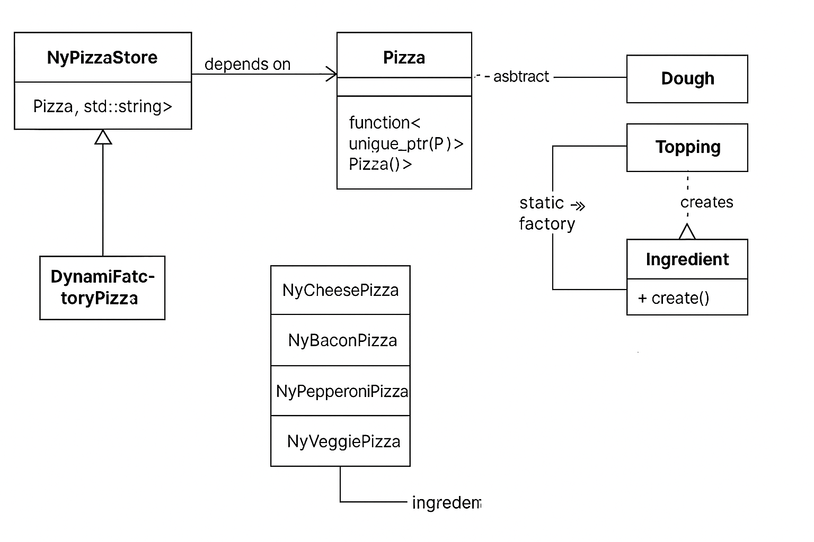

# 🍕 C++ Pizza Patterns – A Modern Take on Factory Design Patterns


[](https://github.com/errowdrigorena/pizza_factory/actions)
[](LICENSE)
[](https://github.com/errowdrigorena/pizza_factory/actions)

This project is a polished demonstration of two foundational creational design patterns—**Factory Method** and **Abstract Factory**—implemented in modern, guideline-compliant C++20. It showcases not only mastery of the patterns themselves but also best practices in extensibility, testing, CI, and code hygiene.

---

## 🚀 Why This Matters

Naive implementations of Factory Method or Abstract Factory often rely heavily on inheritance and hardcoded logic. This project replaces that with a **composition-based**, **open/closed** architecture:

✅ Easy to extend – add pizzas, toppings, or doughs with zero changes to existing logic.  
✅ Clean and scalable – designed with maintainability and testing in mind.  
✅ Demonstrates modern C++ – smart pointers, lambdas, perfect forwarding, and more.

---

## 🧭 Architecture Overview



---

## 🏛️ Patterns in Practice

| Pattern          | Purpose                                  | Example                             |
|------------------|-------------------------------------------|-------------------------------------|
| Factory Method   | Create one product with variants          | `NyPizzaStore::order("cheese")`     |
| Abstract Factory | Compose families of related objects       | `NyIngredientFactory` for dough/tops|

---

## ▶️ Quick Start

```bash
git clone https://github.com/errowdrigorena/pizza_factory.git
cd pizza_factory
cmake -B build
cmake --build build
ctest --test-dir build
```

---

## 🍽️ Sample Output (simulated)

```
Ordering a pepperoni pizza...
-> Thin Crust Dough
-> Tomato Sauce
-> Mozzarella Cheese
-> Pepperoni
Ready to serve!
```

---

## 🧪 Tests

GoogleTest unit tests are included for all variants:
```bash
ctest --output-on-failure
```

---

## 🛠️ Tech Stack

- C++20
- GoogleTest
- CMake 3.16+
- GitHub Actions (CI/CD)
- Clang-Tidy & Clang-Format
- Benchmarking with `<chrono>`

---

## 📄 License

This project is licensed under the MIT License.

